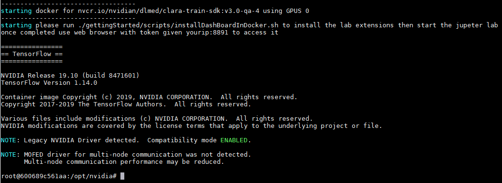
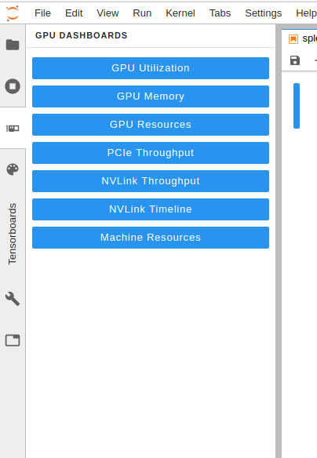

# Notebooks for Clara Train SDK 

This is a set of multiple notebooks which walks you through Clara train SDK features and capabilities.  
There are multiple notebooks showing:
- Performance gains
- Hyper parameter optimization with AutoML
- Federated learning features
- Domain specific examples
- Assisted annotation   

## Pre-requisites 

1. One or more Nvidia GPU. (2+GPUS are recommended for advanced features as AutoML).
2. If you already have docker installed then user should be in the docker group. 
Otherwise, sudo is needed to install the pre requisite 
 
This NoteBooks contain:

1. Scripts to: 
    1. Install pre-requisite as Docker 19, docker compose  
    2. Start pulling the clara docker and run jupyter lab.
3. SampleData: To start using the sdk.
3. Multiple Notebooks to show show all capabilities of the sdk

# Getting started 
## 1. Install pre-req
If you already have docker 19+, nvidia docker, and docker compose you can skip this step. 
Otherwise, you can install docker and docker compose using script provided by  
```
cd scripts 
sudo installDocker.sh
```
## 2. Run the docker

To begin, go into the scripts folder
          
       cd scripts

run command below which will pull the latest clara train SDK and start it in interactive mode.
 
    ./startDocker.sh <portForNotebook> <gpulist>  <AIAA_PORT>

For example to run with 4 gpus on port `8890` and AIAA server on port `5000` run

    ./startDocker.sh 8890 '"device=1,3"' 5000
    
By default `./startDocker.sh` will use all gpu available and ports 8890 for notebooks and 5000 for AIAA 

Now you should be inside the docker as see output similar to


## 3. Start jupyter lab 

In order to start jupyter lab only, you could simple run command below. You could also install GPU extensions then start the Jupyter lab as in step 3.1  

    ./claraDevDay/scripts/startJupyterLabOnly.sh

#### 3.1 (optional) Install GPU Dashboard extension and Start jupyter lab

This docker uses the GPU Dashboard extension from RAPIDS AI team in NVIDIA (https://github.com/rapidsai/jupyterlab-nvdashboard). 
Please run the following commands inside the docker to install the plugins and run jupyterlab

    ./claraDevDay/scripts/installDashBoardInDocker.sh

## 4. Open Browser with given token

Now you can go to your browser on the port you specified above (default is 8890) with the token provided in the terminal. 
You should see jupyter lab where you should start running the [Welcome Notebook](Welcome.ipynb). 
This page shows all notebooks available as 


#### 5. Activating GPU Dashboard (optional if executed 3.1)

Before starting, we need to activate the GPU Dashboard. 
Look at the left sidebar and click on `System Dashboards`. 


Next, click on `GPU Utilization`, `GPU Memory`,`GPU Resources`, and `MachineResources`. 
All of these will open in new tabs. 
Click and hold on `GPU Utilization` tab and drag it to the right most area of screen. 
It will dock the tab on top of the notebook. 
Follow the same procedure with `GPU Memory` tab and docker it on the bottom right of screen. 
The result should be similar to

Now we can see GPU Utilization and GPU Memory while we run through the notebooks.

